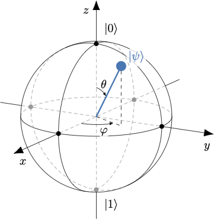
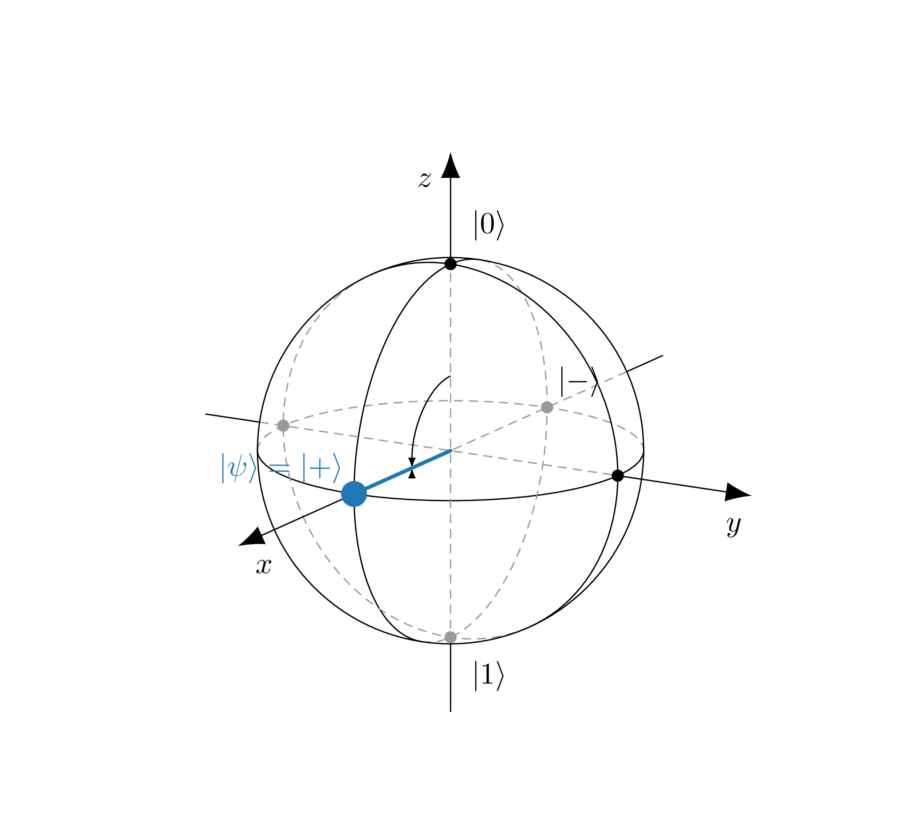

# Notions essentielles d'informatique quantique pour le protocole BB84

**BB84** est un protocole de distribution quantique de clé (QKD).

La cryptographie classique d’aujourd’hui repose souvent sur des problèmes mathématiques difficiles. La distribution quantique de clé (QKD), elle, est différente : elle sécurise les clés grâce aux lois de la physique quantique. Si une espionne (Eve) essaie d’observer, l’acte même de mesurer perturbe les états quantiques et révèle sa présence.

Bienvenue dans ce tutoriel conçu pour vous préparer au défi BB84 en informatique quantique. Ce guide vous fournira les connaissances de base nécessaires pour comprendre les concepts clés de l'informatique quantique — qubit, superposition, mesure et effondrement, théorème de non‑clonage — et vous aidera à vous familiariser avec les outils et techniques utilisés dans le protocole BB84.

Ce tutoriel est accompagné du notebook `tutorial.ipynb`, qui vous permet de pratiquer pas à pas les notions abordées au moyen d’exemples courts et réutilisables.

---

## Qubit & Superposition

Un qubit est l’unité fondamentale de l’information quantique, analogue au bit classique mais avec des propriétés uniques. Contrairement à un bit classique qui peut être soit 0 soit 1, un qubit peut exister dans une **superposition** des deux états simultanément.

L’état d’un qubit $\psi\rangle$ est décrit par un vecteur complexe, 

$$\begin{equation}|\psi\rangle = \begin{bmatrix}\alpha\ \\ \beta \end{bmatrix}\end{equation}$$

tel que $|\alpha|^2 + |\beta|^2 = 1$. En notation de Dirac (ou [notation bra-ket](https://en.wikipedia.org/wiki/Bra%E2%80%93ket_notation)), on a $|\psi\rangle = \alpha |0\rangle + \beta |1\rangle$.

Example:
- $|\psi\rangle = 1 |0\rangle + 0 |1\rangle = |0\rangle$, the qubit est 100% dans l'état |0⟩
  
- $|\psi\rangle = 0 |0\rangle + 1 |1\rangle = |1\rangle$, the qubit est 100% dans l'état |1⟩
  
- $|\psi\rangle = \frac{1}{\sqrt{2}} |0\rangle + \frac{1}{\sqrt{2}} |1\rangle$. On l’appelle l’état $|+\rangle$, qui est une superposition égale des états |0⟩ et |1⟩, qui signfier 50% de chance de mesurer 0 et 50% de chance de mesurer 1.
  
- $|\psi\rangle = \frac{1}{\sqrt{2}} |0\rangle - \frac{1}{\sqrt{2}} |1\rangle$. On l’appelle l’état $|-\rangle$. De meme, c'est une superposition égale avec un signe opposé pour l'état |1⟩.

- ...etc

### Sphère de Bloch (intuition)

La [sphère de Bloch](https://en.wikipedia.org/wiki/Bloch_sphere) est un excellent repère visuel : chaque état pur d’un qubit correspond à un point sur la sphère. Il y a donc une infinité d’états possibles pour un qubit.

<p align="center">
  
</p>

---
## Portes quantiques

Par analogie, comme les portes logiques classiques (NOT, AND, OR, XOR) transforment des bits, les portes quantiques transforment des qubits. La différence clé : elles agissent sur des amplitudes complexes et des phases, et elles sont réversibles.

Exemples :

### Portes de base à un qubit (X, H, Z)
- X : « NOT » quantique — échange |0⟩ et |1⟩. 
  - $X|0\rangle = |1\rangle$
  - $X|1\rangle = |0\rangle$.
- H (Hadamard) : crée/retire la superposition — envoie |0⟩ vers |+⟩ et |1⟩ vers |−⟩.
  - $H|0\rangle = \frac{1}{\sqrt{2}}(|0\rangle + |1\rangle) = |+\rangle$
  - $H|1\rangle = \frac{1}{\sqrt{2}}(|0\rangle - |1\rangle) = |-\rangle$
- Z : inverse la phase de |1⟩ — essentiel pour l’interférence.
  - $Z|0\rangle = |0\rangle$
  - $Z|1\rangle = -|1\rangle$

### Porte à deux qubits (CNOT)
CNOT (Controlled-NOT) : porte à deux qubits, analogue à un XOR contrôlé. Elle agit sur un qubit de contrôle et un qubit cible : si le qubit de contrôle est |1⟩, elle applique une porte X sur le qubit cible (l'inverse); sinon, elle ne fait rien.

**Convention de notation :**
1. **Little-endian (comme Qiskit)** : dans |ab⟩, on lit **de droite à gauche** → b = qubit 0, a = qubit 1.
2. **Choix du contrôle/cible** : dans les exemples ci-dessous, on suppose que **qubit 0 = contrôle** et **qubit 1 = cible** (notation : $\text{CNOT}_{0 \rightarrow 1}$). En pratique, ce choix peut changer selon le circuit.

Exemples avec $\text{CNOT}_{0 \rightarrow 1}$ :
  - $\text{CNOT}|00\rangle = |00\rangle$ (q₀=0 → pas d'inversion sur q₁)
  - $\text{CNOT}|01\rangle = |11\rangle$ (q₀=1 → inverser q₁ : 0→1)
  - $\text{CNOT}|10\rangle = |10\rangle$ (q₀=0 → pas d'inversion sur q₁)
  - $\text{CNOT}|11\rangle = |01\rangle$ (q₀=1 → inverser q₁ : 1→0)

### Formulation mathématique :

Une porte quantique est une transformation unitaire décrite par une matrice complexe.

$$\begin{equation}U = \begin{bmatrix}u_{00} & u_{01} \\ u_{10} & u_{11}\end{bmatrix}\end{equation}$$ 

avec $U^{\dagger} U = I$ (propriété unitaire : la transformation est réversible et préserve les probabilités).

**Appliquer une porte = multiplication matricielle**

Appliquer une porte quantique à un qubit revient à multiplier la matrice de la porte par le vecteur d'état :

$$|\psi'\rangle = U|\psi\rangle = \begin{bmatrix}u_{00} & u_{01} \\ u_{10} & u_{11}\end{bmatrix} \begin{bmatrix}\alpha \\ \beta\end{bmatrix} = \begin{bmatrix}u_{00}\alpha + u_{01}\beta \\ u_{10}\alpha + u_{11}\beta\end{bmatrix}$$

Le résultat est un nouvel état (nouveau vecteur) qui représente l'état transformé du qubit.

**Note importante — Pourquoi le quantique ?**

Même si cela ressemble à de simples multiplications matricielles, la dimension de l'espace d'états croît **exponentiellement** : pour *n* qubits, on manipule des vecteurs de dimension $2^n$ et des matrices $2^n \times 2^n$. 

- 10 qubits → vecteurs de 1024 dimensions
- 50 qubits → vecteurs de $\sim 10^{15}$ dimensions (impossible à simuler classiquement)

Un ordinateur quantique effectue ces transformations **naturellement** en parallèle sur tous les états en superposition, ce qui est hors de portée des machines classiques au-delà de quelques dizaines de qubits.

---

## Circuits quantiques

Un **circuit quantique** est la représentation visuelle et opérationnelle d'un algorithme quantique. C'est une séquence de portes quantiques appliquées à un ou plusieurs qubits, suivie généralement d'une ou plusieurs mesures.

### Structure d'un circuit

Un circuit comporte :
- **Un ou plusieurs registres quantiques** : ensemble(s) de qubits sur lesquels on applique des portes
- **Un ou plusieurs registres classiques** (optionnel) : ensemble(s) de bits classiques qui stockent les résultats des mesures

### Représentation graphique

Dans un diagramme de circuit quantique :
- **Une ligne horizontale = un qubit**
- **Lecture de gauche à droite** (ordre temporel)
- **Les portes** sont représentées par des symboles sur les lignes
- **Une porte peut agir sur un ou plusieurs qubits** (ex : CNOT relie deux lignes)

**Exemple simple :**

```
     ┌───┐┌─┐
q_0: ┤ H ├┤M├
     └───┘└╥┘
c: 1/══════╩═
```

- `q_0` : qubit 0
- `H` : porte Hadamard
- `M` : mesure
- `c: 1/` : registre classique de 1 bit
- Le résultat de la mesure est stocké dans le bit classique 0

---

## La mesure et l’effondrement de l’état

Un bit classique est lu directement : 0 ou 1. Pour un qubit, la lecture est plus subtile. On ne lit jamais directement « l’état » continu d’un qubit—on ne lit qu’un résultat de mesure binaire 0/1 selon une base choisie.

On choisit d’abord une base de mesure (par exemple l'axe Z ou X sur la sphere de bloch), puis l’appareil fait une projection de l'état (sur l'axe) et renvoie un résultat binaire 0 ou 1.

L’acte de mesurer projette l’état quantique sur l’un des états de base et détruit la superposition: c’est l’effondrement (collapse).

La règle de Born fixe les probabilités de ces résultats: si l’état est $|\psi\rangle = \alpha|0\rangle + \beta|1\rangle$, alors $P(0)=|\alpha|^2$, $P(1)=|\beta|^2$.

Une mesure individuelle reste intrinsèquement aléatoire, mais en répétant l’expérience sur de nombreux qubits préparés de la même façon, on retrouve ces probabilités.

**Note importante :** la mesure est une opération non réversible qui détruit la superposition et toute information quantique contenue dans l’état du qubit. Par conséquent, **il est impossible, avec une seule mesure, de déterminer l’état initial d’un qubit avant la mesure**.

### Theoreme de non-clonage
Le théorème de non‑clonage stipule qu’il est impossible de créer une copie parfaite d’un état quantique inconnu. Cela a des implications profondes pour la sécurité en cryptographie quantique, car un espion ne peut pas simplement copier les qubits transmis sans perturber leur état.

## Les bases de mesure — choisir son « angle de vue »

Jusqu'à présent, nous avons principalement parlé des états |0⟩ et |1⟩, car ils représentent les deux résultats possibles de la **base computationnelle** (aussi appelée **base Z**, car elle correspond à l'axe Z sur la sphère de Bloch). Mais il existe une infinité de façons de « regarder » un qubit. Chaque choix s'appelle une **base de mesure**.

### C'est quoi une base de mesure ?

Une base de mesure, c'est le « repère » ou l'« axe » selon lequel on interroge le qubit. La question est toujours la même : **« De quel côté de l'axe es-tu ? Positif ou négatif ? »** — et la réponse est toujours binaire : **0 (positif) ou 1 (négatif)**.

**Intuition avec la sphère de Bloch :** 
Chaque base correspond à un axe (Z, X, Y, ou n'importe quel autre axe). Mesurer dans une base, c'est projeter l'état du qubit sur cet axe et lire de quel côté il « tombe » :
- Côté positif de l'axe → résultat **0**
- Côté négatif de l'axe → résultat **1**

### Les deux bases principales en BB84 : Z et X

**Base Z (computationnelle)** : { |0⟩, |1⟩ }
- **Axe vertical** sur la sphère de Bloch
- |0⟩ = pôle nord (Z+) → mesure donne **0** avec certitude
- |1⟩ = pôle sud (Z−) → mesure donne **1** avec certitude
- Question : « Es-tu du côté positif (|0⟩) ou négatif (|1⟩) de l'axe Z ? »

**Base X (diagonale)** : { |+⟩, |−⟩ }
- **Axe horizontal** (équateur) sur la sphère de Bloch
- |+⟩ = direction X+ → mesure donne **0** avec certitude
- |−⟩ = direction X− → mesure donne **1** avec certitude
- Question : « Es-tu du côté positif (|+⟩) ou négatif (|−⟩) de l'axe X ? »


### Exemple visuel : l'état |+⟩ sur la sphère de Bloch

Imaginons un qubit préparé dans l'état |+⟩ (sur l'équateur, direction X+) :

<p align="center">
  
</p>

- **Mesuré en base X** : le qubit est parfaitement aligné avec X+
  → Résultat = |+⟩ (**0**), 100% certain, car |+⟩ = côté positif de X

- **Mesuré en base Z** : le qubit est exactement sur l'équateur, à égale distance des pôles Z+ et Z−
  → Résultat = **0 ou 1** (≈50/50, aléatoire !)

### Règle générale : même base vs bases différentes

- **Même base** : si l'état est préparé dans la même base que la mesure → résultat **déterministe** (on retrouve le bit encodé)
- **Bases différentes** : si l'état est préparé dans une base différente de celle de la mesure (par exemple, préparé en X et mesuré en Z, ou vice-versa) → résultat **aléatoire** (≈50/50)

**Note technique :** En BB84, les bases Z et X sont orthogonales (perpendiculaires sur la sphère de Bloch). C'est cette propriété qui garantit le résultat aléatoire 50/50.


### Comment mesurer en base X si les machines mesurent toujours en base Z ?

**Astuce pratique** : Appliquer une porte H avant de mesurer en Z revient à mesurer en base X !

Pourquoi ? Parce que H « fait pivoter » la sphère de Bloch de 90° et aligne l'axe X sur l'axe Z. Ainsi :
- |+⟩ devient |0⟩ → mesure en Z donne 0
- |−⟩ devient |1⟩ → mesure en Z donne 1

--------------------------------------------------

## Encoder des bits dans différentes bases

Maintenant que nous comprenons ce qu'est une base de mesure et comment mesurer dans différentes bases (Z par défaut, X avec la porte H), passons à l'étape suivante : **comment préparer (encoder) un bit d'information dans une base spécifique ?**

C'est exactement ce que fait Alice dans le protocole BB84 : elle encode des bits 0 ou 1 soit dans la base Z, soit dans la base X, de manière aléatoire.

### Principe général

Pour encoder un bit dans une base :
1. On part toujours de l'état initial |0⟩
2. On applique des portes quantiques pour atteindre l'état désiré
3. Le choix des portes dépend de la base (Z ou X) et du bit à encoder (0 ou 1)

### Encodage en base Z

**Base Z** : les états sont |0⟩ et |1⟩ (les pôles nord et sud de la sphère de Bloch)

- **Encoder 0 en base Z** → état |0⟩
  - Aucune porte nécessaire (état par défaut) : `|0⟩` (rien à faire)

- **Encoder 1 en base Z** → état |1⟩
  - Appliquer une porte X (NOT quantique) : `X|0⟩ = |1⟩`

**Résumé base Z :**
| Bit à encoder | État cible | Portes à appliquer |
|---------------|------------|-------------------|
| 0             | \|0⟩       | (aucune)          |
| 1             | \|1⟩       | X                 |

### Encodage en base X

**Base X** : les états sont |+⟩ et |−⟩ (l'équateur de la sphère de Bloch)

- **Encoder 0 en base X** → état |+⟩
  - Appliquer une porte H : `H|0⟩ = |+⟩`
  - Rappel : $|+\rangle = \frac{1}{\sqrt{2}}(|0\rangle + |1\rangle)$

- **Encoder 1 en base X** → état |−⟩
  - Appliquer une porte H puis une porte Z : `Z(H|0⟩) = Z|+⟩ = |−⟩`
  - Rappel : $|-\rangle = \frac{1}{\sqrt{2}}(|0\rangle - |1\rangle)$

**Résumé base X :**
| Bit à encoder | État cible | Portes à appliquer |
|---------------|------------|-------------------|
| 0             | \|+⟩       | H                 |
| 1             | \|−⟩       | H puis Z          |


### Exemple complet : encoder une séquence de bits

Imaginons qu'Alice veut encoder la séquence `0 1 0 1` dans les bases `Z Z X X`: 

| Position | Bit | Base | État cible | Portes à appliquer | Transformation       |
|----------|-----|------|------------|-------------------|-----------------------|
| 0        | 0   | Z    | \|0⟩       | (aucune)          | \|0⟩ (état initial)   |
| 1        | 1   | Z    | \|1⟩       | X                 | X\|0⟩ → \|1⟩          |
| 2        | 0   | X    | \|+⟩       | H                 | H\|0⟩ → \|+⟩          |
| 3        | 1   | X    | \|−⟩       | H puis Z          | ZH\|0⟩ → \|−⟩         |


---

## 6) BB84 — en bref (détails dans `bb84_challenge.py`)

- Alice encode des bits dans des bases aléatoires (Z/X) et envoie les qubits.
- Bob mesure chaque qubit dans des bases (Z/X) également aléatoires.
- Ils comparent publiquement les bases et ne gardent que les positions où elles coïncident (tamisage).
- Un petit sous‑ensemble révélé sert à estimer le taux d’erreurs pour détecter une interception éventuelle (Eve).

Pourquoi c’est sécurisé (intuition): mesurer dans la mauvaise base perturbe les états (erreurs détectables) et le théorème de non‑clonage empêche Eve d’espionner sans trace.

Pour la description complète, suivez les étapes et la logique déjà documentées dans `bb84_challenge.py`.

## 9) Itinéraire d’apprentissage conseillé

1) Lisez cette page une fois en diagonale. 2) Ouvrez `tutorial.ipynb` et exécutez les exemples dans l’ordre. 3) Ouvrez `bb84_challenge.py` et complétez les TODO en réutilisant la boîte à outils ci‑dessus. 4) Testez « sans Eve », puis « avec Eve ».

---

## L'intrication quantique (Entanglement) — une notion fondamentale

**Note importante :** Cette notion n'est **pas utilisée dans le protocole BB84** que vous allez implémenter, mais c'est un concept **fondamental** de l'informatique quantique que tout informaticien quantique doit connaître. D'autres protocoles comme **E91** (cryptographie quantique basée sur l'intrication) l'utilisent intensivement.

### Qu'est-ce que l'intrication ?

L'**intrication** (ou **entanglement**) est un phénomène quantique où deux (ou plusieurs) qubits deviennent **corrélés** de manière si profonde qu'ils ne peuvent plus être décrits indépendamment, même s'ils sont séparés par des distances arbitrairement grandes.

**Intuition simple :** une corrélation parfaite. Une fois intriqués, les résultat des qubits sont liés. Si vous mesurez l'un et obtenez un résultat (par exemple, 0), vous connaissez instantanément le résultat que donnera la mesure de l'autre (qui sera aussi 0 dans notre exemple), peu importe la distance qui les sépare.

### Exemple : les états de Bell

Les **états de Bell** sont les états intriqués les plus célèbres. Par exemple, l'état de Bell $|\Phi^+\rangle$ :

$$|\Phi^+\rangle = \frac{1}{\sqrt{2}}(|00\rangle + |11\rangle)$$

**Ce que cela signifie :**
- Les deux qubits sont dans une superposition : soit **tous les deux à |0⟩**, soit **tous les deux à |1⟩**
- Si on mesure le premier qubit et qu'on obtient 0 → le second sera **toujours** 0
- Si on mesure le premier qubit et qu'on obtient 1 → le second sera **toujours** 1
- **Avant la mesure**, aucun des deux n'a d'état défini individuellement !


Bon challenge !
